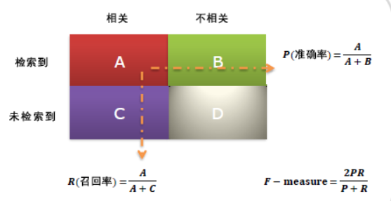

### 评价指标

- **TP**：`Ture Positive`，把正的预测为正的。正阳性， A
- **FN**：`False Negative`，把正的判断为负的。假阴性，B
- **FP**：`False Positive`，把负的判断为正的。假阳性，C
- **TN**：`Ture Negative`，把负的判断为负的。正阴性，D

|            | 正样本 | 负样本 |
| :--------: | :----: | :----: |
| 预测为`正` |   TP   |   FP   |
| 预测为`负` |   FN   |   TN   |

精确率`precision`，表示**预测为正的样本中，有多少是对的**。

`precision`= TP/(TP+FP)

Recall = TP/(TP+FN)

F1 = 2 * P * R/(P+R)

准确率Accuracy = (TP + TN)/(TP+TN+FP+FN)

word2vec

CBOW

Skip-

两个规律：

1. 利用上下文的词，预测中间词
2. 利用上文词，预测下文词